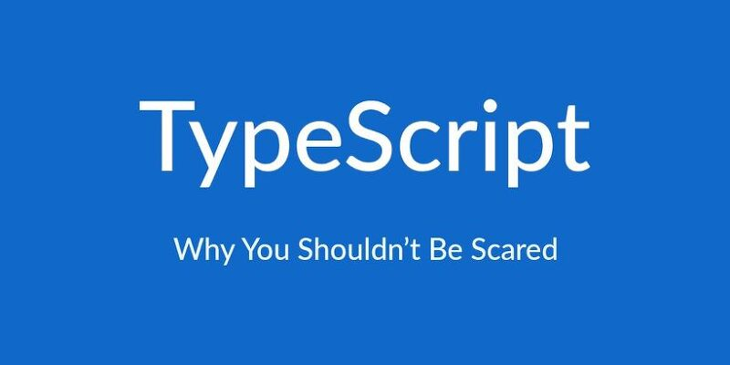

# JS -> Typescript

## 코어 JS

### 코어JS/Jest 학습

[js jest](https://github.com/DosImpact/lecture_ts_tutorial_02/tree/master/js-core/js-jest)

### 코어JS/공식 문서 학습

[js docs](https://github.com/DosImpact/lecture_ts_tutorial_02/tree/master/js-core/js-docs)

## 코어 TS 학습

[typescript 공식 헨드북 정리](https://github.com/DosImpact/lecture_ts_tutorial_02/tree/master/ts-handbook)

## 리액트 TSX 학습

[리액트+typescript 적용 강좌- 소스 코드](https://github.com/DosImpact/lecture_ts_tutorial_02/tree/master/ts-react)

[리액트+typescript 적용 강좌- 정리 마크다운](https://github.com/DosImpact/lecture_ts_tutorial_02/tree/master/ts-react-docs)

## node.js + typesciprt 학습

## playground

---



- [0] practices~~
- [1] JS -> TS
- [2] JSX -> TSX
- [3] node.js -> typing

```
.
├── [0] playground
├── [0] playground_cra
├── [0] practices
├── [1] ts-docs
├── [1] ts-handbook
├── [3] ts-node
├── [2] ts-react
├── [0] ts-react-practice
├── [1] ts_doit_recap
└── [1] ts_doit_source

```

--

# 타입스크립트 학습

# 01 - 바닐라 TS

```
DO it typescript : ts 기본서 (진행중)
- 소스 코드 :  ts_doit_source
- 내용 정리 코드 : ts_doit_recap
- playground
```

# 01 - TS Node

```
제로초 - Node + TS 강의 (진행중)
```

# 01 - TS React

```
제로초 - React + TS 강의 (진행중)
```

### 01장 타입스크립트와 개발 환경 만들기

- [✔] 01-1 타입스크립트란 무엇인가?
- [✔] 01-2 타입스크립트 주요 문법 살펴보기
- [✔] 01-3 타입스크립트 개발 환경 만들기

### 02장 타입스크립트 프로젝트 생성과 관리

- [✔] 01-1 타입스크립트 프로젝트 만들기
- [✔] 02-2 모듈 이해하기
- [✔] 02-3 tsconfig.json 파일 살펴보기

### 03장 객체와 타입

- [✔] 03-1 타입스크립트 변수 선언문
- [✔] 03-2 객체와 인터페이스
- [✔] 03-3 객체와 클래스
- [✔] 03-4 객체의 비구조화 할당문
- [✔] 03-5 객체의 타입 변환

### 04장 함수와 메서드

- [ ] 04-1 함수 선언문
- [ ] 04-2 함수 표현식
- [ ] 04-3 화살표 함수와 표현식 문
- [ ] 04-4 일등 함수 살펴보기
- [ ] 04-5 함수 구현 기법
- [ ] 04-6 클래스 메서드

### 05장 배열과 튜플

- [ ] 05-1 배열 이해하기
- [ ] 05-2 선언형 프로그래밍과 배열
- [ ] 05-3 배열의 map, reduce, filter 메서드
- [ ] 05-4 순수 함수와 배열
- [ ] 05-5 튜플 이해하기

### 06장 반복기와 생성기

- [ ] 06-1 반복기 이해하기
- [ ] 06-2 생성기 이해하기

### 07장 Promise와 async/await 구문

- [ ] 07-1 비동기 콜백 함수
- [ ] 07-2 Promise 이해하기
- [ ] 07-3 async와 await 구문

### 08장 함수 조합의 원리와 응용

- [ ] 08-1 함수형 프로그래밍이란?
- [ ] 08-2 제네릭 함수
- [ ] 08-3 고차 함수와 커리
- [ ] 08-4 함수 조합

### 09장 람다 라이브러리

- [ ] 09-1 람다 라이브러리 소개
- [ ] 09-2 람다 기본 사용법
- [ ] 09-3 배열에 담긴 수 다루기
- [ ] 09-4 서술자와 조건 연산
- [ ] 09-5 문자열 다루기
- [ ] 09-6 chance 패키지로 객체 만들기
- [ ] 09-7 렌즈를 활용한 객체의 속성 다루기
- [ ] 09-8 객체 다루기
- [ ] 09-9 배열 다루기
- [ ] 09-10 조합 논리 이해하기

### 10장 제네릭 프로그래밍

- [ ] 10-1 제네릭 타입 이해하기
- [ ] 10-2 제네릭 타입 제약
- [ ] 10-3 대수 데이터 타입
- [ ] 10-4 타입 가드
- [ ] 10-5 F-바운드 다형성
- [ ] 10-6 nullable 타입과 프로그램 안정성

### 11장 모나드

- [ ] 11-1 모나드 이해하기
- [ ] 11-2 Identity 모나드 이해와 구현
- [ ] 11-3 Maybe 모나드 이해와 구현
- [ ] 11-4 Validation 모나드 이해와 구현
- [ ] 11-5 IO 모나드 이해와 구현

### 12장 프로젝트 실습

- [ ] 12-1 빅데이터 배치 프로그램 만들기
- [ ] 12-2 몽고DB에 데이터 저장하기
- [ ] 12-3 익스프레스 API 서버 만들기
- [ ] 12-4 리액트와 부트스트랩으로 프런트엔드 웹 만들기


```js
import React from "react";
import { render } from "react-dom";
import App from "./App";

//0
import { Map, List } from "immutable";

//1
const user = Map({
  name: "doyoung",
  study: Map({
    cs: 10,
    alog: 20,
  }),
});

console.log(user.toJS());

//2
const course = List([
  Map({ name: "python" }),
  Map({ name: "C++" }),
  Map({ name: "JAVA" }),
]);
console.log(course.toJS());

//3. 새로운 값으로 바꾸고, 다른 obj 리턴

let oUser = user.set("name", "alsrud");
console.log(oUser.toJS());
// console.log(oUser === user); // false

//4. 값을 읽을때 - get 이용
console.log(user.get("name"));
console.log(course.get(0).toJS());

//5. 읽은다음에 설정? : prev => ...
let oUser2 = user.update("name", (prev) => prev + "[우수생]");
console.log(oUser2.toJS());
// console.log(oUser === oUser2); // false
// console.log(user === oUser2); // false

//6 with deep depth => []
let oUser3 = user.setIn(["study", "cs"], 100);
console.log(oUser3.getIn(["study", "cs"]));

let nCourse = course.setIn([0, "name"], "Golang");
console.log(nCourse.getIn([0, "name"]));

//7

let nCourse2 = course.push(Map({ name: "SQL" }));
console.log(nCourse2.toJS());
let nCourse3 = course.filter((e) => e.get("name") === "python");
console.log(nCourse3.toJS());

//8
let oUser4 = user.delete("name");
console.log(oUser4.toJS());

let nCourse4 = course.delete(0);
console.log(nCourse4.toJS());

render(<App />, document.getElementById("root"));
```
